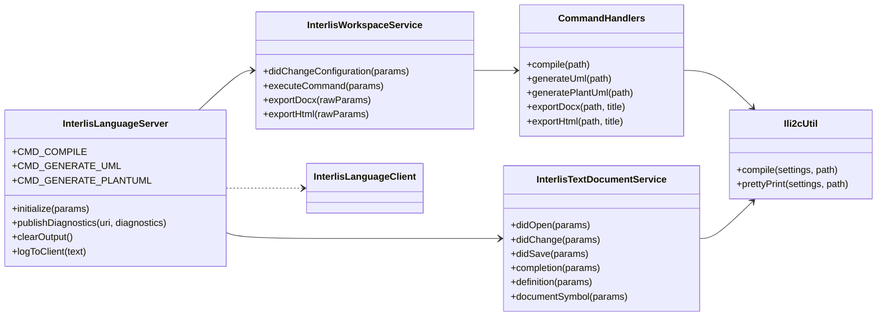
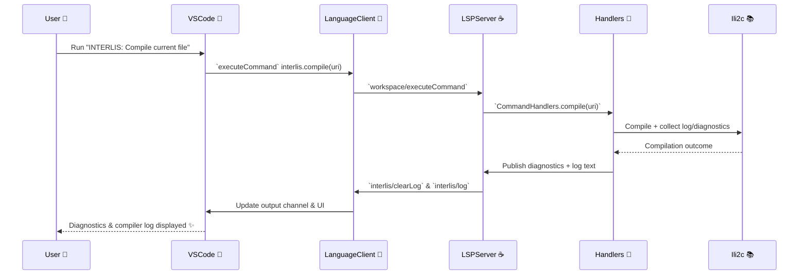

# INTERLIS Language Server & VS Code Extension 🧩

## todo documentation
- lsp debug in vscode: https://chatgpt.com/codex/tasks/task_e_693a978dd550832894d81b25295bc541


A monorepo that ships the INTERLIS-focused Language Server Protocol (LSP) implementation together with the accompanying VS Code extension. This document is aimed at developers who want to extend, debug, or package the tooling. For an end-user feature tour head over to the [client README](client/README.md). 💡

## Table of contents
- [Architecture at a glance](#architecture-at-a-glance)
- [Language server capabilities](#language-server-capabilities)
- [Commands & custom requests](#commands--custom-requests)
- [Runtime delivery & packaging](#runtime-delivery--packaging)
- [Developer workflow](#developer-workflow)
  - [Working on the LSP](#working-on-the-lsp)
  - [Working on the VS Code extension](#working-on-the-vs-code-extension)
  - [End-to-end debugging](#end-to-end-debugging)
- [Automated checks](#automated-checks)
- [Diagrams](#diagrams)
  - [Class relationships](#class-relationships)
  - [Compile command sequence](#compile-command-sequence)
- [Additional resources](#additional-resources)

## Architecture at a glance

```
repo/
├── build.gradle            # Gradle build orchestrating the Java server & tests
├── src/main/java           # LSP implementation (lsp4j based)
├── src/test/java           # Unit & integration tests
├── client/                 # VS Code extension (TypeScript + esbuild)
└── build/                  # Gradle output (fat jar, test reports, etc.)
```

- The Java LSP is packaged as a fat JAR via the `shadowJar` Gradle task.
- The VS Code extension embeds the server JAR and platform-specific JREs so that teams can distribute a single `.vsix` with no external dependencies. 🚀
- The extension and server communicate over stdio using `vscode-languageclient`.

## Language server capabilities

`InterlisLanguageServer#initialize` wires up the server capabilities advertised to clients. The resulting payload (serialized via LSP) looks like this:

```json
{
  "capabilities": {
    "positionEncoding": "utf-16",
    "textDocumentSync": {
      "openClose": true,
      "change": 2,
      "save": {
        "includeText": false
      }
    },
    "completionProvider": {
      "triggerCharacters": [".", ":"],
      "resolveProvider": false
    },
    "documentFormattingProvider": true,
    "documentOnTypeFormattingProvider": {
      "firstTriggerCharacter": "="
    },
    "definitionProvider": true,
    "renameProvider": true,
    "documentSymbolProvider": true,
    "executeCommandProvider": {
      "commands": [
        "interlis.compile",
        "interlis.uml",
        "interlis.uml.plant"
      ]
    }
  }
}
```

Key listeners and providers derived from these capabilities:

| Event / Provider 💬 | Implementation | Notes |
| --- | --- | --- |
| `textDocument/didOpen` | `InterlisTextDocumentService#didOpen` | Compiles freshly opened files and streams diagnostics. |
| `textDocument/didChange` | `InterlisTextDocumentService#didChange` | Updates the in-memory document tracker & invalidates caches. |
| `textDocument/didSave` | `InterlisTextDocumentService#didSave` | Performs authoritative compilation using on-disk content. |
| `textDocument/didClose` | `InterlisTextDocumentService#didClose` | Clears diagnostics and releases document state. |
| `textDocument/completion` | `InterlisTextDocumentService#completion` | Provides context-aware completions (triggered by `.` or `:`). |
| `textDocument/formatting` | `InterlisTextDocumentService#formatting` | Runs ili2c pretty printer for whole-document formatting. |
| `textDocument/onTypeFormatting` | `InterlisTextDocumentService#onTypeFormatting` | Auto-inserts INTERLIS templates after typing `=`. |
| `textDocument/definition` | `InterlisTextDocumentService#definition` | Resolves definitions across workspace & referenced models. |
| `textDocument/rename` | `InterlisTextDocumentService#rename` + `InterlisRenameProvider` | Applies validated renames across declarations and references. |
| `textDocument/documentSymbol` | `InterlisTextDocumentService#documentSymbol` | Builds outline nodes from the compiled AST. |
| `workspace/didChangeConfiguration` | `InterlisWorkspaceService#didChangeConfiguration` | Refreshes server-side model repository settings. |

## Commands & custom requests

Workspace commands advertised via `initialize`:

| Command ID | VS Code command | Description |
| --- | --- | --- |
| `interlis.compile` | `interlis.compile.run` | Compile current file, publish diagnostics, and return compiler log. |
| `interlis.uml` | `interlis.uml.show` | Compile & render a Mermaid UML diagram as HTML. |
| `interlis.uml.plant` | `interlis.uml.plant.show` | Compile & render PlantUML as HTML. |

Custom JSON-RPC requests handled with `@JsonRequest`:

| Request | VS Code caller | Description |
| --- | --- | --- |
| `interlis/exportGraphml` | `interlis.graphml.export` | Returns a GraphML UML class diagram as UTF-8 text. |
| `interlis/exportDocx` | `interlis.docx.export` | Returns a Base64 DOCX payload derived from the compiled model. |
| `interlis/exportHtml` | `interlis.html.show` | Returns rendered HTML documentation for previews. |

Server-to-client notifications ✉️:

| Notification | Payload | Purpose |
| --- | --- | --- |
| `interlis/clearLog` | none | Clear the shared output channel before new compiler runs. |
| `interlis/log` | `{ text: string }` | Stream ili2c logs into the VS Code output view. |

## Runtime delivery & packaging

The extension bundles both the language server JAR and a trimmed JRE per platform so that users can run the tooling without installing Java. The expected folder layout inside the packaged extension is:

```
client/
  server/
    interlis-lsp-<version>-all.jar
    jre/
      darwin-arm64/
      darwin-x64/
      linux-x64/
      linux-arm64/
      win32-x64/
        bin/java(.exe)
```

To refresh runtimes:
1. Produce a new fat JAR with `./gradlew shadowJar` (output lives in `build/libs/`).
2. Copy platform-specific JREs into `client/server/jre/<platform>/`.
3. Update `client/package.json` version if you plan to publish.
4. Package the extension via `cd client && npm install && npm run build && npx vsce package`.

Tip 👉 For CI packaging see the `build and publish` GitHub Actions workflow, which automatically runs `vsce publish` when the `VS_MARKETPLACE_TOKEN` secret is configured.

## Developer workflow

### Working on the LSP

| Task | Command | Notes |
| --- | --- | --- |
| Run the server via stdio | `./gradlew run` | Prints logs to the console, communicates via stdin/stdout. |
| Build a fat JAR | `./gradlew shadowJar` | Produces `build/libs/interlis-lsp-<version>-all.jar`. |
| Execute unit tests | `./gradlew test` | Covers compilation cache, diagnostics mapping, formatting, etc. |
| Format sources | `./gradlew spotlessApply` | If you enable [Spotless](https://github.com/diffplug/spotless) locally. |

### Working on the VS Code extension

1. Install dependencies: `cd client && npm install`.
2. Build once or watch: `npm run build` or `npm run watch` (uses esbuild ⚡).
3. Launch VS Code with the extension: `code client --extensionDevelopmentPath="$(pwd)/client"`.
4. During development, point the extension to your local server build by setting `interlisLsp.server.jarPath`.

#### Meta-attribute highlighting

Meta attributes in INTERLIS start with the `!!` comment prefix, followed by an `@`-prefixed body (for example `!!@trace`). The
TextMate grammar (`client/syntaxes/interlis.tmLanguage.json`) now splits those pieces into distinct scopes:

| Segment | Scope | Purpose |
| --- | --- | --- |
| `!!` | `punctuation.definition.comment.interlis` | Keeps the leading characters styled as comments. |
| `@trace` | `entity.name.tag.meta-attribute.interlis` | Marks the attribute body so `editor.tokenColorCustomizations` rules can target it. |

Because the attribute body is assigned a dedicated scope, theme authors and users can safely add a `textMateRules` override such
as:

```jsonc
"editor.tokenColorCustomizations": {
  "textMateRules": [
    {
      "scope": "entity.name.tag.meta-attribute.interlis",
      "settings": {
        "foreground": "#d19a66"
      }
    }
  ]
}
```

VS Code applies the rule to any token carrying that scope, ensuring consistent coloring across light and dark themes while the
comment prefix retains its original appearance.

### End-to-end debugging

- Start the LSP with `./gradlew run` and configure the extension to use the spawned process by editing `client/src/extension.ts` or setting a custom launch config.
- Use the VS Code "Run and Debug" panel with the "Extension" configuration to attach a debugger to the client TypeScript code.
- Enable verbose tracing by setting `"interlisLsp.trace.server": "verbose"` in your workspace settings and check the INTERLIS output channel. 🔍

## Automated checks

The repository relies on Gradle for Java builds/tests and npm scripts for the extension. In CI, we typically run:

- `./gradlew check` – compiles the server and runs all tests.
- `cd client && npm run build` – ensures the TypeScript bundle compiles.

## Diagrams

### Class relationships



### Compile command sequence



## Additional resources

- [Client feature overview & screenshots](client/README.md) 📸
- [ili2c project](https://github.com/claeis/ili2c) – underlying compiler used by the LSP.
- [Language Server Protocol specification](https://microsoft.github.io/language-server-protocol/specification) for deeper integration details.
