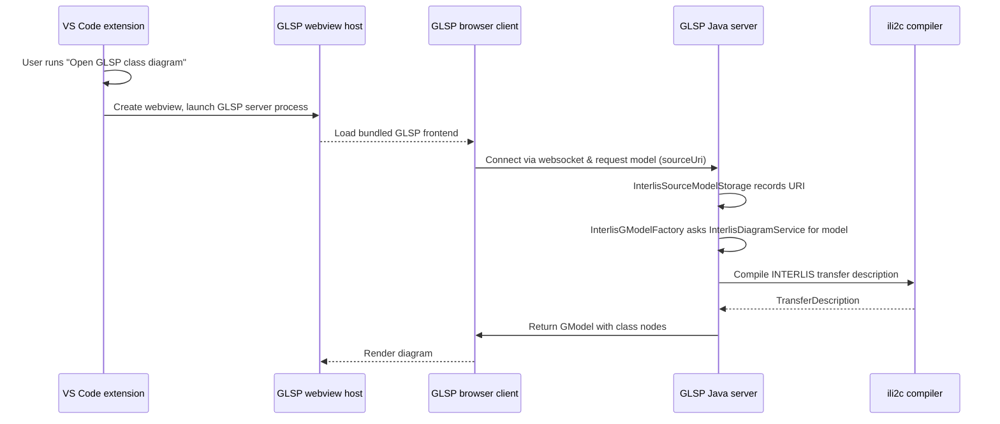

# INTERLIS GLSP Server

This project hosts the Eclipse GLSP server that renders UML class diagrams for INTERLIS models. The server is packaged with the VS Code extension so that diagrams can be shown alongside the textual `.ili` editor.

The current prototype extracts the top-level classes from the active INTERLIS model and lays them out in a simple grid. Each node
is rendered using the GLSP default rectangle view with INTERLIS-specific colours, so that the diagram updates as soon as the
underlying `.ili` file is saved or re-opened.

## Request flow at a glance

## Opening the diagram next to the text editor

The extension keeps the standard text editor as the default view for `.ili` files. Use the **INTERLIS: Open GLSP class diagram** command to open the diagram while the text editor remains visible:

1. Open the INTERLIS model in the normal text editor.
2. Run the command from the Command Palette or the status bar. The GLSP webview opens in a column beside the text editor, allowing both views to stay in sync.

You can also reach the same behaviour through **Open With… → INTERLIS UML Diagram (GLSP)** on any `.ili` file. Multiple diagram editors can be opened at once, each showing the live diagram for its corresponding document.

